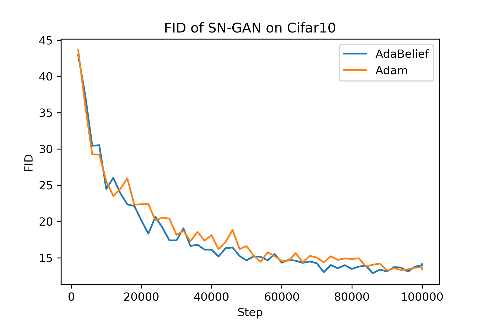

## SNGAN-AdaBelief
Train a state-of-the-art spectral normalization GAN with AdaBelief.

### Acknowledgement
This repo is forked from ```PyTorch-StudioGAN``` github repository, with the only difference in optimizer.

### How to run
```
python main.py -t -e -c configs/CIFAR10/SNGAN-adabelief.json
```

### Results
Results for Adam is directly taken from the training log of official implementation https://github.com/POSTECH-CVLab/PyTorch-StudioGAN/blob/master/logs/SNGAN-train-2020_09_18_14_37_00.log

|     | Adam  | AdaBelief |
|:---:|-------|-----------|
| FID | 13.25 | 12.87     |


